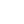

# Thyago de Sousa

<pre style="background:black;color:white;padding:15px;border-radius:8px">
root@root:~$ whoami
Thyago

root@root:~$ role
Cybersecurity Student

root@root:~$ interests
Coffee | Security | Hacking | Protection
</pre>

---

## Tools

---

## Currently Learning

<pre style="background:black;color:white;padding:15px;border-radius:8px">
root@root:~$ learning
- Linux Administration
- Network Security
- Python for Security
- Basic Digital Forensics
- SIEM & Log Analysis
</pre>

---

## TryHackMe

---

## GitHub Stats

---

## Activity Graph

---

## Terminal

<pre style="background:black;color:white;padding:15px;border-radius:8px">
root@root:~$ echo "Stay curious. Stay secure."
Stay curious. Stay secure.
</pre>
